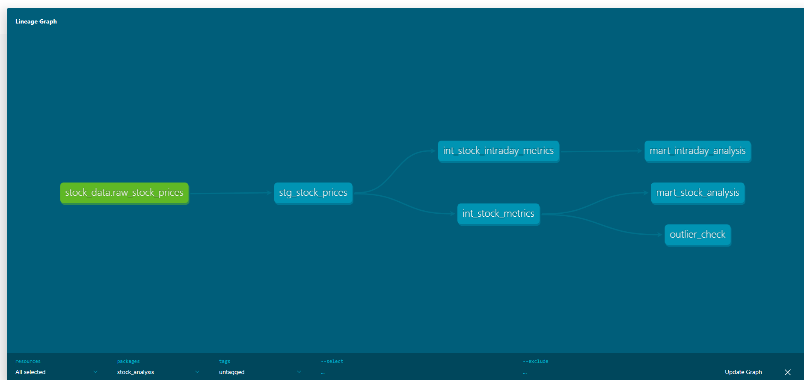
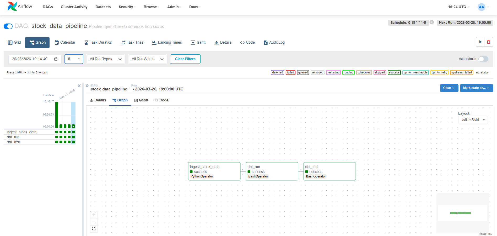

# Pipeline Analytics Engineer - Données Boursières CAC 40

Pipeline ELT avec dbt, Airflow et PostgreSQL analysant 5 actions du CAC 40.

## Objectif

Créer un pipeline ELT complet orchestré par Airflow, avec transformations dbt et tests automatisés.

## Architecture



**3 couches dbt :**
- **Staging** : Nettoyage et typage
- **Intermediate** : Calculs métier (variations, moyennes mobiles, volatilité)
- **Marts** : Tables finales pour analyse

**Orchestration Airflow :**
- Ingestion quotidienne (Yahoo Finance API)
- Transformations dbt
- Tests qualité données



## Stack technique

- **Ingestion** : Python (yfinance, SQLAlchemy)
- **Base de données** : PostgreSQL
- **Transformations** : dbt-core
- **Orchestration** : Apache Airflow
- **Infrastructure** : Docker Compose

## Installation

```bash
# 1. Cloner le repo
git clone [url]
cd Projet_05_Yahoo_Finance

# 2. Configurer .env
cp .env.example .env
# Éditer .env avec vos credentials

# 3. Lancer Docker
docker-compose up -d

# 4. Accéder à Airflow
# http://localhost:8080 (airflow / airflow)
```

## 🚀 Usage

**Lancer le pipeline :**
- Activer le DAG dans Airflow
- Cliquer sur Play pour exécution manuelle

**Voir la doc dbt :**
```bash
cd stock_analysis
dbt docs generate
dbt docs serve
```

## ✅ Résultats

- **5 modèles dbt** fonctionnels (staging → intermediate → marts)
- **12 tests** qualité données (100% succès)
- **2 scripts** ingestion (full refresh + incrémental)
- **Pipeline Airflow** automatisé

## 🎓 Compétences

- Architecture ELT / Bronze-Silver-Gold
- dbt (modélisation, tests, documentation)
- Orchestration Airflow
- SQL avancé (window functions, CTEs)
- Docker / Gestion des secrets
- Data Quality

---

**Contact :** pascal.lamerenspro@gmail.com | [LinkedIn](https://linkedin.com/in/pascal-lamerens)
